# Make Parties Angular Frontend

A frontend designed to work with my [Spring Boot Make Parties backend](https://github.com/jdegand/make-parties-spring-backend).  

## Screenshots

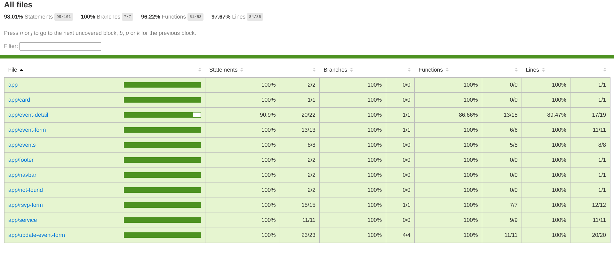

***

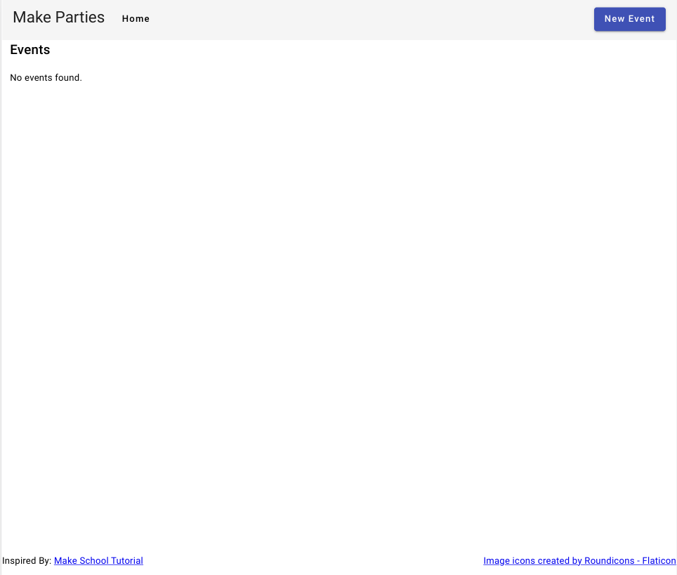

***

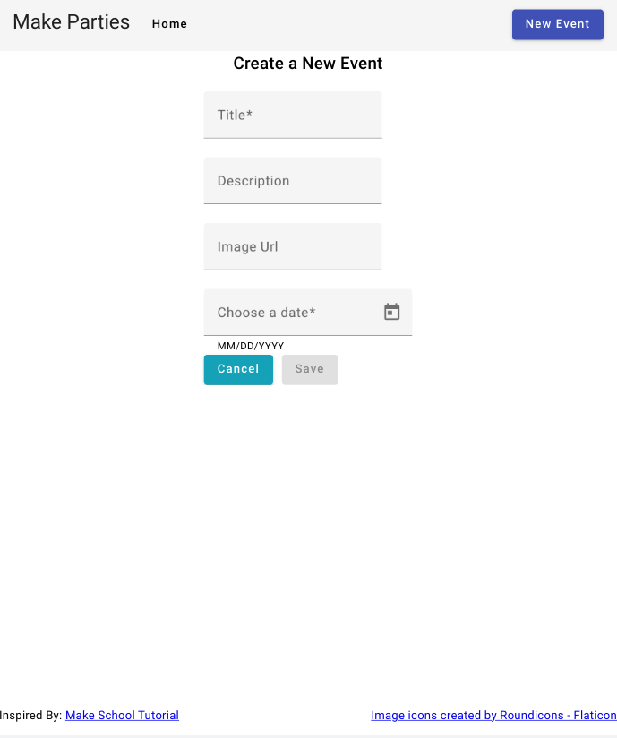

***

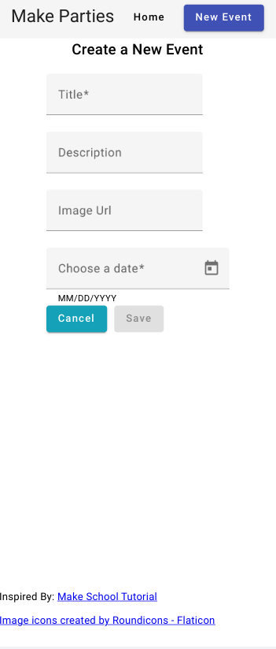

***

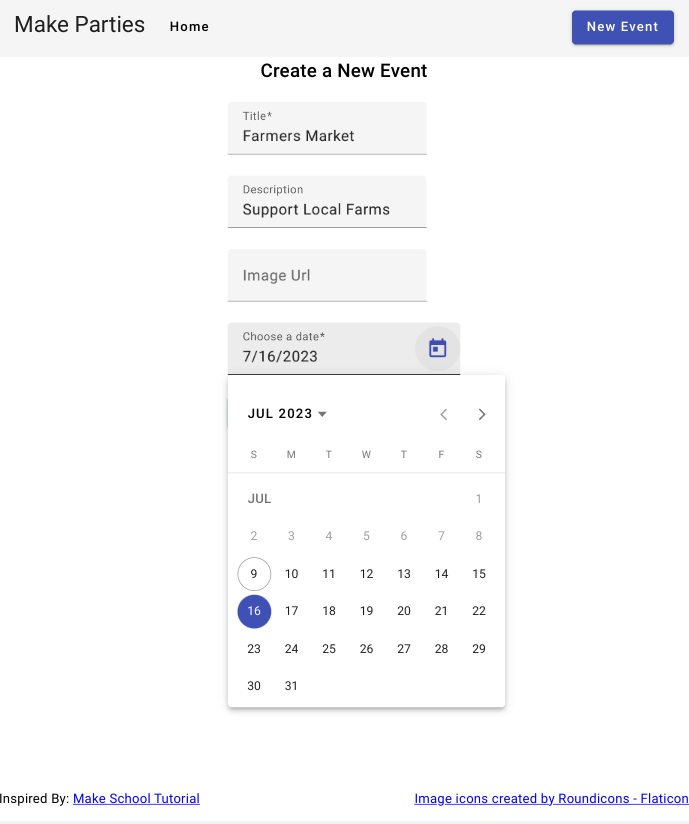

***

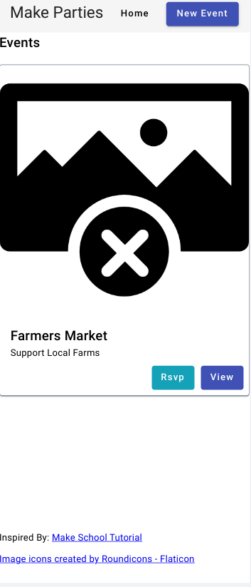

***

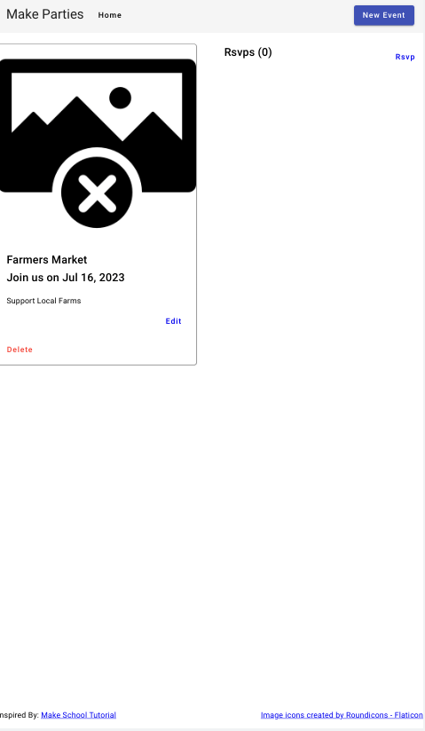

***

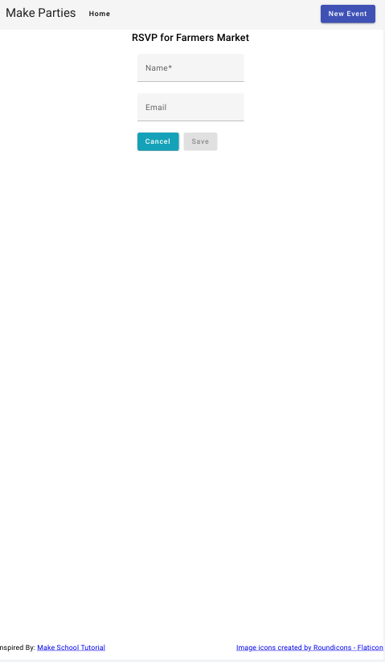

***

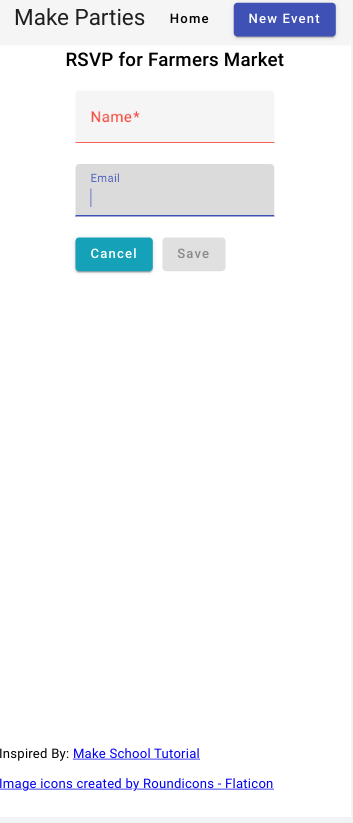

***

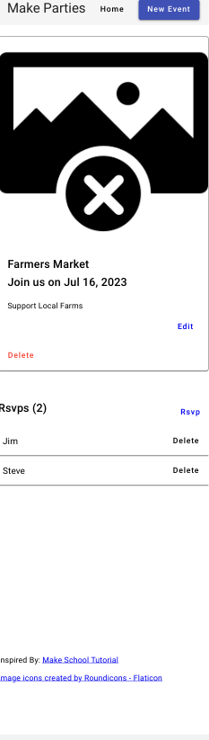

***

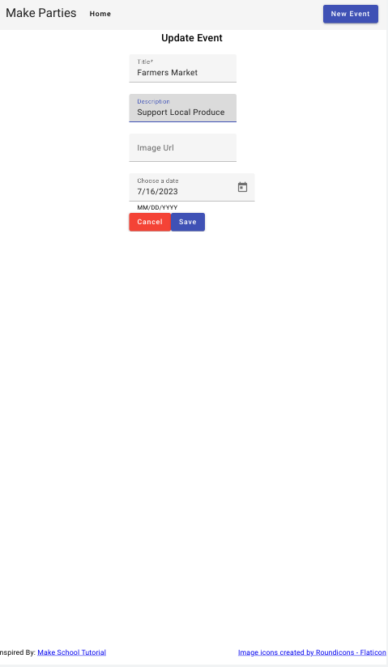

***

## Built With

- [Angular](https://angular.dev)
- [Angular CLI](https://github.com/angular/angular-cli)
- [Angular Material](https://material.angular.io/)

## How to Use

The Spring Boot application runs by default on `localhost:8080` and has the following endpoints:

- `http://localhost:8080/events` - GET / POST
- `http://localhost:8080/events/${id}` - GET / PUT / DELETE
- `http://localhost:8080/events/${eventId}/rsvps` - POST
- `http://localhost:8080/events/${eventId}/rsvps/${rsvpId}` - DELETE

### Running the Spring Boot Backend Application

```bash

git clone https://github.com/jdegand/make-parties-spring-backend.git

# configured with maven - run the scripts included with the repo 

```

### Running the Angular Application

Run the backend first.  Use two terminals.  

```bash

git clone https://github.com/jdegand/make-parties-angular-frontend.git

# cd into the directory
npm install 

npm start

# Tests - firefox launcher is included - need to install a karma launcher that matches your browser  

ng test

```

## Thoughts

- I thought this would be a nice test of my Spring and Angular skills.
- [MakeParties](https://makeschool.org/mediabook/oa/tutorials/make-tweets/start-an-express-project-z9Y=/) design translates well to them.
- I adhered to the design of the MakeSchool tutorial and replicated it with slight differences.
- I used standalone components except for the app component.
- I used reactive forms and patchValue to set pre-filled values for the update event form.
- You could put services in sub-folders, ie `service/events/events.service.ts` and you could change the service names; the way I named them resulted in the class being initially called `ApiServiceService`.
- I used mock data to work out some styling for event fields versus always having to have the spring backend running.  The mockData implementation is commented out in the events component.
- The backend was complete (sans rsvps routes) when I started creating the frontend.
- I added validation first to the frontend and then applied that to the backend.
- Made the footer and header fixed - added scroll for the events component's body.
- There was overscroll at the end of events list because of margin placed between events -> used a last variable to remove the margin from the last of event-cards -> using `:last-of-type` did not work.
- Used [lorem picsum](https://picsum.photos/) for placeholder image urls -> could use many other similar services or even upload your own images to cloudinary.
- No validation for the image urls - placeholder image from Flaticon is displayed if user fails to provide an `imgUrl`.
- Could cap the event's image width to an even smaller amount - need `object-fit:cover` to preserve aspect ratio of image.
- I used a `mat-card-image` attribute on each event image.
- I originally used async pipe for the events component -> can be drawbacks to using async pipe -> See this [video](https://www.youtube.com/watch?v=Z9U9-VRN_XU) for more.  
- Changed from async pipe to regular subscription in events component.  With async pipe, it is more difficult to show a message when the subscription returns no data.
- I show a 'Could not connect to server' message when an error occurs and I show a 'No events found' message when the backend database has no entries.  
- I used `[min]` on the Date field although I am using validators - better to use a custom validator instead ?
- Using `[min]` is a lot easier to implement, but it is not consistent with how I am validating all the other fields.
- Used a fair amount of components -> possible to clean up and have better component reuse?
- On `event-detail` page, I added an extra link for the rsvp form.
- Debatable if it is better to use `routerLink` over mat-buttons that are styled like links.
- Angular material can have accessiblity issues.
- I didn't go overboard on styling - using a sticky footer presented some difficulty on mobile as the footer overlaps the card when there are multiple events.  I changed the footer from being stacked in a flex column in the left corner to using row and `justify-content:space-between`.  On mobile, this choice causes word wrap because the footer text is too long.
- Could have used modals instead of routing to a form for updating or creating rsvps.
- I added a delete button to delete events on the event detail page.
- After deleting the event, the backend sent a string like `Event ${id} deleted`.
- This caused an error to be thrown in the frontend and this prevented the page from being reloaded as the complete callback would not run.
- I changed the backend to send JSON, and now it works as intended.
- Replaced and removed `karma-chrome-launcher`.
- Angular 16 doesn't initialize a karma config file anymore.  Need to use `ng generate config karma`.
- Added `codeCoverage: true` to `angular.json`.
- Use `xdescribe` to skip a test block. Use `xit` to skip an individual test.
- Angular 15 testing code uses `compileComponents()` after the `TestBed.configureTestingModule()` method.  Seems like this is no longer required in Angular 16.
- I used `window.location.reload` in the `event-detail` component.  During testing, this causes a infinite loop.  I moved the call to `window.location.reload` into a reloadPage function.  Then I could mock that function to return nothing so that all tests run with no problems.  However, the reloadPage function is said to be uncovered in the code coverage report. I have experimented with different scenarios and nothing has changed.
- Upgraded from Angular 16 to 17.  There is a deprecation warning for `RouterTestingModule` in the app test.

## Continued Development

- TypeScript improvements
- Cypress
- Custom Validator for min Date
- Styling tweaks
- Accessibility concerns - cancel button color contrast, etc
- Code Consistency

## Useful Resources

- [Flaticon](https://www.flaticon.com/)
- [Lorem Picsum](https://picsum.photos/)
- [Lorem Ipsum](https://loremipsum.io/21-of-the-best-placeholder-image-generators/) - placeholder image generators
- [Wikimedia](https://commons.wikimedia.org/wiki/File:Image_not_available.png) - image not available
- [Stack Overflow](https://stackoverflow.com/questions/45144023/angular-material-design-how-to-add-custom-button-color) - angular design custom button color
- [YouTube](https://www.youtube.com/watch?v=qOZOeu6YcJc) - Creating and Using Reactive Forms | Angular Forms | Angular 13+
- [Stack Overflow](https://stackoverflow.com/questions/52035029/set-mindate-maxdate-dynamically-on-html-datepicker) - min / max date datepicker
- [Stack Overflow](https://stackoverflow.com/questions/49284110/angular5-custom-validator-for-date-min) - custom validator for date min
- [Stack Overflow](https://stackoverflow.com/questions/46502294/angular-change-matinput-size) - matinput size
- [YouTube](https://www.youtube.com/watch?v=Z9U9-VRN_XU) - Async Pipe Is Broken in Angular
- [Stack Overflow](https://stackoverflow.com/questions/34088209/how-to-pass-object-from-one-component-to-another-in-angular-2) - pass object from one component to another
- [Stack Overflow](https://stackoverflow.com/questions/45997369/how-to-get-param-from-url-in-angular-4) - get param from url
- [RxJs](https://rxjs.dev/deprecations/subscribe-arguments) - subscribe arguments
- [Stack Overflow](https://stackoverflow.com/questions/63382484/how-to-init-default-values-for-angular-form-from-async-request-form-control) - how to set default values for angular form to async request data
- [Stack Overflow](https://stackoverflow.com/questions/55275025/how-to-set-value-to-form-control-in-reactive-forms-in-angular) - how to set value to form control in reactive forms in angular
- [Theme Isle](https://themeisle.com/blog/missing-images-on-website/) - missing images on website
- [Stack Overflow](https://stackoverflow.com/questions/4774022/whats-default-html-css-link-color) - default html css link color
- [Stack Overflow](https://stackoverflow.com/questions/46027652/typescript-interface-how-to-declare-a-property-of-array-type) - typescript interface how to declare a property of array type
- [Stack Overflow](https://stackoverflow.com/questions/53539728/how-to-validate-date-in-the-format-mm-dd-yyyy-in-spring-boot) - how to validate date in mm-dd-yyyy format
- [Stack Overflow](https://stackoverflow.com/questions/46502294/angular-change-matinput-size) - matinput size
- [Stack Overflow](https://stackoverflow.com/questions/35269179/angular-conditional-class-with-ngclass) - ngClass
- [Blog](https://blog.bitsrc.io/6-ways-to-unsubscribe-from-observables-in-angular-ab912819a78f) - 6 ways to unsubscribe
- [YouTube](https://www.youtube.com/watch?v=ddyxKtfOMqU) - takeUntilDestroyed
- [Stack Overflow](https://stackoverflow.com/questions/56767679/should-i-unsubscribe-after-a-complete) - should I unsubscribe after a complete
- [Stack Overflow](https://stackoverflow.com/questions/52198240/rxjs-difference-between-complete-and-unsubscribe-in-observable) - complete and unsubscribe difference
- [YouTube](https://www.youtube.com/watch?v=emnwsVy8wRs&list=PLoC8Q0moRTSiTBAKWBGiJjFUMpiFdaGdF&index=1&pp=iAQB) - Introduction | Angular Unit Testing
- [YouTube](https://www.youtube.com/watch?v=15othucRXcI) - 30. Testing Services which has HttpClient as dependency by using Jasmine Spy - Angular Unit testing
- [Angular Docs](https://angular.io/guide/testing-services) - testing services
- [Blog](https://offering.solutions/blog/articles/2017/10/02/testing-an-angular-http-service/) - testing an angular http service
- [Stack Overflow](https://stackoverflow.com/questions/59676310/get-element-by-attribute-name-angular-testing) - get element by attribute name angular testing
- [Concrete Page](https://www.concretepage.com/angular/angular-testbed-compilecomponents) - compileComponents()
- [Blog](https://danielk.tech/home/how-to-test-reactive-angular-forms) - how to test reactive angular forms
- [Stack Overflow](https://stackoverflow.com/questions/50863422/angular-5-ng-test-please-include-either-browseranimationsmodule-or-noopan) - BrowserAnimationsModule
- [Stack Overflow](https://stackoverflow.com/questions/40093013/unit-testing-click-event-in-angular) - angular test click event
- [Stack Overflow](https://stackoverflow.com/questions/73361624/angular-unit-test-how-to-test-reactive-form-reset-method) - reactive form reset method
- [Testing Angular](https://testing-angular.com/testing-complex-forms/) - testing complex forms
- [Gitbook](https://baldur.gitbook.io/angular/angular-test/testing/angular-testing/spyon) - spyOn
- [Stack Overflow](https://stackoverflow.com/questions/64061277/why-my-mocked-service-property-is-undefined-in-jasmine-unit-test) - mocked service property is undefined
- [Stack Overflow](https://stackoverflow.com/questions/39960146/testing-error-case-with-observables-in-services) - testing error case with observables in services
- [Stack Overflow](https://stackoverflow.com/questions/45917883/how-do-you-mock-activatedroute) - activatedRoute mock
- [Stack Overflow](https://stackoverflow.com/questions/39791773/how-can-i-unit-test-a-component-that-uses-the-router-in-angular) - unit test a component that uses router
- [Stack Overflow](https://stackoverflow.com/questions/48024481/angular-unit-test-if-component-method-is-called-according-to-a-data-from-a-servi) - angular unit test if component method is called
- [Stack Overflow](https://stackoverflow.com/questions/40093013/unit-testing-click-event-in-angular) - unit test click event in angular
- [YouTube](https://www.youtube.com/playlist?list=PLqQyE6QNucSfUIpucL_nx7vDuwAa1A_VH) - Angular Unit Testing
- [Stack Overflow](https://stackoverflow.com/questions/42770027/how-do-i-check-for-a-console-log-in-karma-jasmine) - how do I check for a console log in karma jasmine
- [Medium](https://jenijoe.medium.com/unit-testing-angular-crud-service-with-jasmine-7e40e7c8aa74) - unit testing angular crud service with jasmine
- [Semaphore CI](https://semaphoreci.com/community/tutorials/testing-routes-in-angular-2) - testing routes
- [Stack Overflow](https://stackoverflow.com/questions/55773888/how-to-unit-test-router-navigate-in-angular-app) - unit test router navigate in angular app
- [Stack Overflow](https://stackoverflow.com/questions/27306194/mock-window-location-reload-in-jasmine-testing) - mock window location reload in jasmine testing
- [Stack Overflow](https://stackoverflow.com/questions/68607971/how-to-unit-test-window-location-reload-in-angular-12-unit-testing) - window location reload
- [Stack Overflow](https://stackoverflow.com/questions/72138851/jasmine-window-location-reload-in-ngondestroy) - location reload
- [Dev.to](https://dev.to/angular/understanding-async-tests-in-angular-f8n) - async tests in angular
